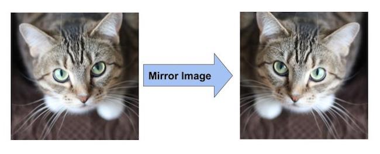
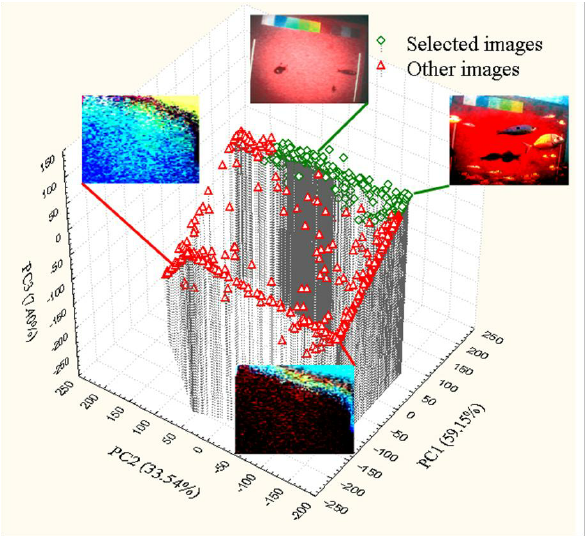

<h1>Alexnet</h1>

2012

&#9472;

<b>Author</b>

Alex Krizhevsky Ilya Sutskever Geoffrey E. Hinton

<h1 class="c20" id="h.au51mny0sx6">Overview</h1>

Until recently, datasets of labeled images were relatively small &nbsp;on the order of tens of thousands of images (e.g., NORB, Caltech-101/256, and CIFAR-10/100). Simple recognition tasks can be solved quite well with datasets of this size, especially if they are augmented with label-preserving transformations. But objects in realistic settings exhibit considerable variability, so to learn to recognize them it is necessary to use much larger training sets. To learn about thousands of objects from millions of images, we need a model with a large learning capacity. Despite the attractive qualities of CNNs, and despite the relative efficiency of their local architecture, they have still been prohibitively expensive to apply in large scale to high-resolution images.

<h1 class="c20" id="h.3at9u9s4e0vp">Dataset</h1>

ImageNet is a dataset of over 15 million labeled high-resolution images belonging to roughly 22,000 categories. Starting in 2010, as part of the Pascal Visual Object Challenge, an annual competition called the ImageNet Large-Scale Visual Recognition Challenge (ILSVRC) has been held. ILSVRC uses a subset of ImageNet with roughly 1000 images in each of 1000 categories. In all, there are roughly 1.2 million training images, 50,000 validation images, and 150,000 testing images. ILSVRC-2010 is the only version of ILSVRC for which the test set labels are available, so this is the version on which they performed most of their experiments. They also entered their model in the ILSVRC-2012 competition. They down-sampled the images to a fixed resolution of 256 &times; 256. Given a rectangular image, they first rescaled the image such that the shorter side was of length 256, and then cropped out the central 256&times;256 patch from the resulting image. they did not pre-process the images in any other way, except for subtracting the mean activity over the training set from each pixel. So they trained their network on the (centered) raw RGB values of the pixels.

<h1 class="c20" id="h.4p7xi5bvhxdr">Architecture</h1>

It contains eight learned layers &mdash; five convolutional and three fully-connected. Below, we describe some of the novel or unusual features of our network&rsquo;s architecture.

<ol class="c17 lst-kix_u41k76iogef-0 start" start="1">
   <li class="c7">
      <h2 id="h.56kfpodyq5td" style="display:inline">ReLU Nonlinearity</h2>
   </li>
</ol>

The standard way to model a neuron&rsquo;s output f as a function of its input x is with f(x) = tanh(x) or f(x) = (1 + e&minus;x) &minus;1 . In terms of training time with gradient descent, these saturating nonlinearities are much slower than the non-saturating nonlinearity f(x) = max(0, x). Deep convolutional neural networks with ReLUs train several times faster than their equivalents with tanh units. This is demonstrated in Figure, which shows the number of iterations required to reach 25% training error on the CIFAR-10 dataset for a particular four-layer convolutional network.

<ol class="c17 lst-kix_u41k76iogef-0" start="2">
   <li class="c7">
      <h2 id="h.i2twq817gk0t" style="display:inline">Training on Multiple GPUs</h2>
   </li>
</ol>

A single GTX 580 GPU has only 3GB of memory, which limits the maximum size of the networks that can be trained on it. It turns out that 1.2 million training examples are enough to train networks which are too big to fit on one GPU. Therefore they spread the net across two GPUs. Current GPUs are particularly well-suited to cross-GPU parallelization, as they are able to read from and write to one another&rsquo;s memory directly, without going through host machine memory. The parallelization scheme that they employ essentially puts half of the kernels (or neurons) on each GPU, with one additional trick: the GPUs communicate only in certain layers. This means that, for example, the kernels of layer 3 take input from all kernel maps in . However, kernels in layer 4 take input only from those kernel maps in layer 3 which reside on the same GPU. Choosing the pattern of connectivity is a problem for cross-validation, but this allows to precisely tune the amount of communication until it is an acceptable fraction of the amount of computation. 

<ol class="c17 lst-kix_u41k76iogef-0" start="3">
   <li class="c7">
      <h2 id="h.hg6fmbgvbtfi" style="display:inline">Local Response Normalization</h2>
   </li>
</ol>

ReLUs have the desirable property that they do not require input normalization to prevent them from saturating. If at least some training examples produce a positive input to a ReLU, learning will happen in that neuron. &nbsp;However, we still find that the following local normalization scheme aids generalization. Denoting by aix,y&nbsp;the activity of a neuron computed by applying kernel i at position (x, y) and then applying the ReLU nonlinearity, the response-normalized activity bix,y&nbsp;is given by the expression 

   

where the sum runs over n &ldquo;adjacent&rdquo; kernel maps at the same spatial position, and N is the total number of kernels in the layer.

<ol class="c17 lst-kix_u41k76iogef-0" start="4">
   <li class="c7">
      <h2 id="h.o4bnba2uzyua" style="display:inline">Overlapping Pooling</h2>
   </li>
</ol>

Pooling layers in CNNs summarize the outputs of neighboring groups of neurons in the same kernel map. To be more precise, a pooling layer can be thought of as consisting of a grid of pooling units spaced &lsquo;S&rsquo; pixels apart, each summarizing a neighborhood of size Z &times; Z centered at the location of the pooling unit. If we set S = Z, we obtain traditional local pooling as commonly employed in CNNs. If we set S &lt; Z, we obtain overlapping pooling. This is what they use throughout their network, with S = 2 and Z = 3. This scheme reduces the top-1 and top-5 error rates by 0.4 % and 0.3 %, respectively, as compared with the non-overlapping scheme S = 2, Z = 2, which produces output of equivalent dimensions. They observe during training that models with overlapping pooling find it slightly more difficult to overfit. 

<ol class="c17 lst-kix_u41k76iogef-0" start="5">
   <li class="c7">
      <h2 id="h.2gtnribvznjb" style="display:inline">Overall Architecture</h2>
   </li>
</ol>

The net contains eight layers with weights; the first five are convolutional and the remaining three are fully connected. The output of the last fully-connected layer is fed to a 1000-way softmax which produces a distribution over the 1000 class labels. The kernels of the second, fourth, and fifth convolutional layers are connected only to those kernel maps in the previous layer which reside on the same GPU. Response-normalization layers follow the first and second convolutional layers. Max-pooling layers, follow both response normalization layers as well as the fifth convolutional layer. The ReLU non-linearity is applied to the output of every convolutional and fully-connected layer. 

The first convolutional layer filters the 227&times;227&times;3 input image with 96 kernels of size 11&times;11&times;3 with a stride of 4 pixels. Note that the paper mentions the network inputs to be 224&times;224, but that is a mistake and the numbers make sense with 227&times;227 instead.

Layer 1

<ul class="c17 lst-kix_exo140evy44c-0 start">
   <li class="c2">227 * 227 * 3 images are given to the 1st convolutional layer.</li>
   <li class="c2">Where this layer filters the image with 96 kernels of size 11 * 11 * 3</li>
   <li class="c2">Stride = 4 and padding = 0 Here stride(s) &lt; kernel size(z) (4 &lt; 11), so this overlapping pooling.</li>
   <li class="c2">Therefore output = (227 - 11 + 2 *(0))/4 + 1 = 55</li>
   <li class="c2">Output is of size 55 * 55 * 96 = 290,400 and number of parameters are (11 * 11 * 3 + 1) * 96 = 34,944</li>
   <li class="c2">Then max pooling layer is applied where stride is 2 and kernel size is 3 * 3</li>
   <li class="c2">Therefore now output volume size is &nbsp;((55 - 3) / 2 + 1) = 27, so output volume is of size 27 * 27 * 96 = 96,984 </li>
   <li class="c2">Then to this output, local response normalization(LRN) is applied.</li>
</ul>

The second convolutional layer takes as input the (response-normalized and pooled) output of the first convolutional layer and filters it with 256 kernels of size 5 &times; 5 &times; 48. 

Layer 2

<ul class="c17 lst-kix_exo140evy44c-0">
   <li class="c2">27 * 27 * 96 inputs are given to the 2nd convolutional layer.</li>
   <li class="c2">Where this layer filters the image with 256 kernels of size 5 * 5</li>
   <li class="c2">Stride = 1 and padding = 2 Here stride(s) &lt; kernel size(z) (1 &lt; 5), so this overlapping pooling.</li>
   <li class="c2">Therefore output = (27 - 5 + 2 *(2))/1 + 1 = 27</li>
   <li class="c2">Output is of size 27 * 27 * 256 = 186,624 and number of parameters are (5 * 5 * 96 + 1) *256 = 614,656</li>
   <li class="c2">Then max pooling layer is applied where stride is 2 and kernel size is 3 * 3</li>
   <li class="c2">Therefore now output volume size is &nbsp;((27 - 3) / 2 + 1) = 13, so output volume is of size 13 * 13 * 256 = 43,264 </li>
   <li class="c2">Then to this output, local response normalization(LRN) is applied.</li>
</ul>

The third, fourth, and fifth convolutional layers are connected to one another without any intervening pooling or normalization layers. 

The third convolutional layer has 384 kernels of size 3 &times; 3 &times; 256 connected to the (normalized, pooled) outputs of the second convolutional layer. 

&nbsp;&nbsp;&nbsp;&nbsp;&nbsp;&nbsp;&nbsp;&nbsp;Layer 3

<ul class="c17 lst-kix_exo140evy44c-0">
   <li class="c2">13&nbsp;* 13 * 256 inputs are given to the 3rd convolutional layer.</li>
   <li class="c2">Where this layer filters the image with 384 kernels of size 3 * 3</li>
   <li class="c2">Stride = 1 and padding = 1 Here stride(s) &lt; kernel size(z) (1 &lt; 3), so this overlapping pooling.</li>
   <li class="c2">Therefore output = (13 - 3 + 2 *(1))/1 + 1 = 13</li>
   <li class="c2">Output is of size 13 * 13 * 384 = 64,896 and number of parameters are (3 * 3 * 256 + 1) * 384 = 885,120</li>
</ul>

The fourth convolutional layer has 384 kernels of size 3 &times; 3 &times; 192.

Layer 4

<ul class="c17 lst-kix_exo140evy44c-0">
   <li class="c2">13 * 13 * 384 inputs are given to the 4th convolutional layer.</li>
   <li class="c2">Where this layer filters the image with 384 kernels of size 3 * 3</li>
   <li class="c2">Stride = 1 and padding = 1 Here stride(s) &lt; kernel size(z) (1 &lt; 3), so this overlapping pooling.</li>
   <li class="c2">Therefore output = (13 - 3 + 2 *(1))/1 + 1 = 13</li>
   <li class="c2">Output is of size 13 * 13 * 384 = 64,896 and number of parameters are (3 * 3 * 384 + 1) * 384 = 1,327,488</li>
</ul>

The fifth convolutional layer has 256 kernels of size 3 &times; 3 &times; 192. 

Layer 5

<ul class="c17 lst-kix_exo140evy44c-0">
   <li class="c2">13 * 13 * 384 inputs are given to the 5th convolutional layer.</li>
   <li class="c2">Where this layer filters the image with 256 kernels of size 3 * 3</li>
   <li class="c2">Stride = 1 and padding = 1 Here stride(s) &lt; kernel size(z) (1 &lt; 3), so this overlapping pooling.</li>
   <li class="c2">Therefore output = (13 - 3 + 2 *(1))/1 + 1 = 13</li>
   <li class="c2">Output is of size 13 * 13 * 256 = 43,264 and number of parameters are (3 * 3 * 384 + 1) * 256 = 884,992</li>
   <li class="c2">Then max pooling layer is applied where stride is 2 and kernel size is 3 * 3</li>
   <li class="c2">Therefore now output volume size is &nbsp;((13 - 3) / 2 + 1) = 6, so output volume is of size 6 * 6 * 256 = 9,216</li>
   <li class="c2">Then to this output, Dropout layer with a rate of 0.5 is applied.</li>
</ul>

The fully-connected layers 1 have 4096 neurons.

Layer 6

<ul class="c17 lst-kix_exo140evy44c-0">
   <li class="c2">6&nbsp;* 6 * 256 inputs are given to the 1st fully connected layer of 4096 neurons.</li>
   <li class="c2">So output volume is size is 4096 and number of parameters are &nbsp;(6 * 6 * 256 + 1) * 4096 = 37,752,832</li>
   <li class="c2">Then to this output, Dropout layer with a rate of 0.5 is applied.</li>
</ul>

Layer 7

<ul class="c17 lst-kix_exo140evy44c-0">
   <li class="c2">Images with size of 4096&nbsp;are given to the 2nd fully connected layer of 4096 neurons.</li>
   <li class="c2">So output volume is size is 4096 and number of parameters are &nbsp;(4096 + 1) * 4096 = 16,781,312</li>
</ul>

Layer 8

<ul class="c17 lst-kix_exo140evy44c-0">
   <li class="c2">Images with size of 4096 are given to the final fully connected layer of 1000 neurons.</li>
   <li class="c2">So output volume is size is 1000 and number of parameters are &nbsp;(4096 + 1) * 1000 = 4,097,000</li>
   <li class="c2">Then to this output, a Softmax layer is applied.</li>
</ul>

&nbsp;&nbsp;&nbsp;&nbsp;&nbsp;&nbsp;&nbsp;&nbsp;Over all number of parameters are 62,416,616 = 62.4M

<h1 class="c20" id="h.yyrhu7ml5bea">Reducing Overfitting</h1>

Neural network architecture has 60 million parameters. Although the 1000 classes of ILSVRC make each training example impose 10 bits of constraint on the mapping from image to label, this turns out to be insufficient to learn so many parameters without considerable overfitting. Below, they describe the two primary ways in which they combat overfitting.

<ol class="c17 lst-kix_eqolo11jepiw-0 start" start="1">
   <li class="c7">
      <h2 id="h.buwz1tcz7y35" style="display:inline">Data Augmentation</h2>
   </li>
</ol>

They employ two distinct forms of data augmentation, both of which allow transformed images to be produced from the original images with very little computation. The transformed images are generated in Python code on the CPU while the GPU is training on the previous batch of images. So these data augmentation schemes are, in effect, computationally free. 

The first form of data augmentation consists of generating image translations and horizontal reflections. They do this by extracting random 224 &times; 224 patches (and their horizontal reflections) from the 256&times;256 images and training their network on these extracted patches . Without this scheme, the network suffers from substantial overfitting, which would have forced it to use much smaller networks. 

The second form of data augmentation consists of altering the intensities of the RGB channels in training images. Specifically, they perform PCA on the set of RGB pixel values throughout the ImageNet training set. To each training image, they add multiples of the found principal components, with magnitudes proportional to the corresponding eigenvalues times a random variable drawn from a Gaussian with mean zero and standard deviation 0.1.

<ol class="c17 lst-kix_eqolo11jepiw-0" start="2">
   <li class="c7">
      <h2 id="h.p2nityf5kx5q" style="display:inline">Dropout</h2>
   </li>
</ol>

The recently-introduced technique, called &ldquo;dropout&rdquo; [10], consists of setting to zero the output of each hidden neuron with probability 0.5. The neurons which are &ldquo;dropped out&rdquo; in this way do not contribute to the forward pass and do not participate in backpropagation. So every time an input is presented, the neural network samples a different architecture, but all these architectures share weights. At test time, they use all the neurons but multiply their outputs by 0.5, which is a reasonable approximation to taking the geometric mean of the predictive distributions produced by the exponentially-many dropout networks.

   

<h1 class="c20" id="h.xzxlvfskhaue">Details of learning</h1>

Model is trained using stochastic gradient descent with a batch size of 128 examples, momentum of 0.9, and weight decay of 0.0005. Weight initialization in each layer is from a zero-mean Gaussian distribution with standard deviation 0.01. Initialization of the neuron biases in the second, fourth, and fifth convolutional layers, as well as in the fully-connected hidden layers, with the constant 1. Equal learning rate is used for all layers, which is adjusted manually throughout training. The heuristic approach was to divide the learning rate by 10 when the validation error rate stopped improving with the current learning rate. The learning rate was initialized at 0.01 and 6 reduced three times prior to termination. Trained the network for roughly 90 cycles through the training set of 1.2 million images, which took five to six days on two NVIDIA GTX 580 3GB GPUs. 

<h1 class="c20" id="h.knxfzkwd1ngi">Results</h1>

Results on ILSVRC-2010 are summarized below Table. Network achieves top-1 and top-5 test set error rates of 37.5% and 17.0%.

<table class="c27">
   <tbody>
      <tr class="c13">
         <td class="c16" colspan="1" rowspan="1">
            
Model

         </td>
         <td class="c16" colspan="1" rowspan="1">
            
Top-1

         </td>
         <td class="c16" colspan="1" rowspan="1">
            
Top-5

         </td>
      </tr>
      <tr class="c13">
         <td class="c16" colspan="1" rowspan="1">
            
Sparse coding

         </td>
         <td class="c16" colspan="1" rowspan="1">
            
47.1%

         </td>
         <td class="c16" colspan="1" rowspan="1">
            
28.2%

         </td>
      </tr>
      <tr class="c13">
         <td class="c16" colspan="1" rowspan="1">
            
SIFT + FVs

         </td>
         <td class="c16" colspan="1" rowspan="1">
            
45.7%

         </td>
         <td class="c16" colspan="1" rowspan="1">
            
25.7%

         </td>
      </tr>
      <tr class="c13">
         <td class="c16" colspan="1" rowspan="1">
            
CNN

         </td>
         <td class="c16" colspan="1" rowspan="1">
            
37.5%

         </td>
         <td class="c16" colspan="1" rowspan="1">
            
17.0%

         </td>
      </tr>
   </tbody>
</table>

&nbsp;

Results on ILSVRC-2012 are summarized below Table. The CNN described in this paper achieves a top-5 error rate of 18.2%. Averaging the predictions of five similar CNNs gives an error rate of 16.4%.

<table class="c27">
   <tbody>
      <tr class="c13">
         <td class="c3" colspan="1" rowspan="1">
            
Model

         </td>
         <td class="c3" colspan="1" rowspan="1">
            
Top-1 (val)

         </td>
         <td class="c3" colspan="1" rowspan="1">
            
Top-5 (val)

         </td>
         <td class="c3" colspan="1" rowspan="1">
            
Top-5 (test)

         </td>
      </tr>
      <tr class="c13">
         <td class="c3" colspan="1" rowspan="1">
            
SIFT + FVs

         </td>
         <td class="c3" colspan="1" rowspan="1">
            
-

         </td>
         <td class="c3" colspan="1" rowspan="1">
            
-

         </td>
         <td class="c3" colspan="1" rowspan="1">
            
26.

         </td>
      </tr>
      <tr class="c13">
         <td class="c3" colspan="1" rowspan="1">
            
1 CNN

         </td>
         <td class="c3" colspan="1" rowspan="1">
            
40.7%

         </td>
         <td class="c3" colspan="1" rowspan="1">
            
18.2%

         </td>
         <td class="c3" colspan="1" rowspan="1">
            
-

         </td>
      </tr>
      <tr class="c13">
         <td class="c3" colspan="1" rowspan="1">
            
1 CNN*

         </td>
         <td class="c3" colspan="1" rowspan="1">
            
39.0%

         </td>
         <td class="c3" colspan="1" rowspan="1">
            
16.6%

         </td>
         <td class="c3" colspan="1" rowspan="1">
            
-

         </td>
      </tr>
      <tr class="c13">
         <td class="c3" colspan="1" rowspan="1">
            
7 CNNs*

         </td>
         <td class="c3" colspan="1" rowspan="1">
            
36.7%

         </td>
         <td class="c3" colspan="1" rowspan="1">
            
15.4%

         </td>
         <td class="c3" colspan="1" rowspan="1">
            
15.3%

         </td>
      </tr>
   </tbody>
</table>
<h1 class="c20" id="h.gl5hob3jjjak">Summary</h1>
<ol class="c17 lst-kix_u2rdk15ii0g4-0 start" start="1">
   <li class="c10 c15 c11">Use Relu instead of Tanh to add non-linearity. It accelerates the speed by 6 times at the same accuracy.</li>
   <li class="c10 c15 c11">Use Response Normalization. Nowadays Batch Normalization is used instead of LRN.</li>
   <li class="c10 c11 c15">Use an overlapping style of pooling. It reduces the top-1 and top-5 error rates by 0.4% and 0.3%, respectively.</li>
   <li class="c10 c15 c11">Use dropout instead of regularisation to deal with overfitting. However the training time is doubled with the dropout rate of 0.5.</li>
   <li class="c10 c15 c11">Use two types of data augmentation for reducing overfitting. First form is image translations and horizontal reflections and second form is altering the intensities of the RGB channels in training images. </li>
   <li class="c10 c15 c11">Use stochastic gradient descent with a batch size of 128 examples, momentum of 0.9, and weight decay of 0.0005. </li>
</ol>
<h1 class="c20" id="h.jn3up9ieuqjs">References</h1>

<a class="c14" href="https://www.google.com/url?q=https://papers.nips.cc/paper/4824-imagenet-classification-with-deep-convolutional-neural-networks.pdf&amp;sa=D&amp;ust=1591807523660000">ImageNet Classification with Deep Convolutional Neural Networks</a>&nbsp; by Alex Krizhevsky, Ilya Sutskever, and Geoffrey E. Hinton, 2012

</body></html>

For Detail report of AlexNet architecture click <a href="https://github.com/DhruvMakwana/Computer_Vision/raw/master/AlexNet/AlexNet_Detail_Report.pdf">here</a>

To implement AlexNet in keras using python script run `AlexNet_Keras.py` or to implement AlexNet in keras using notebook run `AlexNet_Keras.ipynb`

To implement AlexNet in pytorch using python script run `AlexNet_pytorch.py` or to implement AlexNet in pytorch using notebook run `AlexNet_pytorch.ipynb`

<b>Note:</b> We have used Batch Normalization in keras version instead of LRN and used LRN in pytorch version.