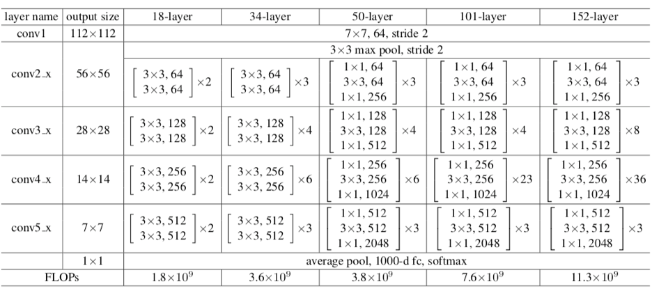
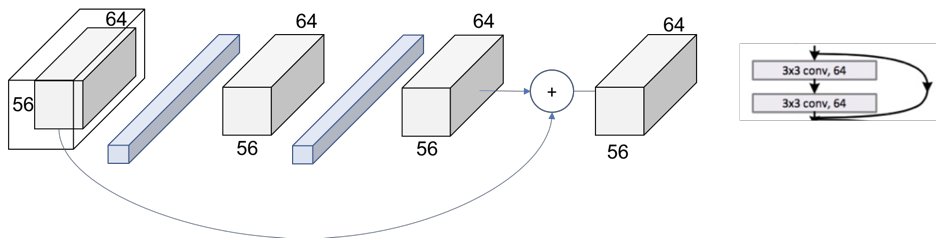

   
<h1>ResNet</h1>

10.12.2015

&#9472;

<b>Authors</b>

Kaiming He Xiangyu Zhang Shaoqing Ren Jian Sun

<h1 class="c26" id="h.hiu8l0pcc7ij">Overview</h1>

Recent study shows that network depth is of crucial importance, and the leading results on the challenging ImageNet dataset all exploit &ldquo;very deep&rdquo; models, with a depth of sixteen to thirty. Many other non trivial visual recognition tasks have also greatly benefited from very deep models.

<b>Is learning better networks as easy as stacking more layers?</b> &nbsp;

An obstacle to answering this question was vanishing/exploding gradients. When deeper networks are able to start converging, a degradation problem has been exposed: with the network depth increasing, accuracy gets saturated and then degrades rapidly. Unexpectedly, such degradation is not caused by overfitting, and adding more layers. 

The degradation (of training accuracy) indicates that not all systems are similarly easy to optimize. Let us consider a shallower architecture and its deeper counterpart that adds more layers onto it. There exists a solution by construction to the deeper model: the added layers are identity mapping, and the other layers are copied from the learned shallower model. The existence of this constructed solution indicates that a deeper model should produce no higher training error than its shallower counterpart. 

<b>What is the solution for this degradation problem?</b>

The solution is introducing a deep residual learning framework. Instead of hoping each few stacked layers directly fit a desired underlying mapping, we explicitly let these layers fit a residual mapping. Formally, denoting the desired underlying mapping as H(x), we let the stacked nonlinear layers fit another mapping of F(x) := H(x) - x. The original mapping is recast into F(x)+x. 

The formulation of F(x) + x can be realized by feedforward neural networks with &ldquo;<b>shortcut connections</b>&rdquo;. Shortcut connections are those skipping one or more layers. In this case, the shortcut connections simply perform identity mapping, and their outputs are added to the outputs of the stacked layers. Identity shortcut connections add neither extra parameter nor computational complexity. The entire network can still be trained end-to-end by SGD with backpropagation.

<b>Does it work?</b>

On the ImageNet classification dataset, this network obtains excellent results by extremely deep residual nets. 152- layer residual net is the deepest network ever presented on ImageNet, while still having lower complexity than VGG nets. Ensemble has a 3.57% top-5 error on the ImageNet test set, and won 1st place in the ILSVRC 2015 classification competition. &nbsp;

<h1 class="c26" id="h.3at9u9s4e0vp">Related work</h1>
<h2 class="c20" id="h.noky1puuo5ci">Residual Representations</h2>

In image recognition, VLAD is a representation that encodes by the residual vectors with respect to a dictionary, and Fisher Vector can be formulated as a probabilistic version of VLAD. In low-level vision and computer graphics, for solving Partial Differential Equations (PDEs), the widely used Multigrid method reformulates the system as subproblems at multiple scales, where each subproblem is responsible for the residual solution between a coarser and a finer scale.

   
<h2>Shortcut Connections</h2> &nbsp;

Practices and theories that lead to shortcut connections have been studied for a long time. &nbsp;

Concurrent with this work, &ldquo;<b>highway networks</b>&rdquo;&nbsp; present shortcut connections with gating functions. These gates are data-dependent and have parameters, in contrast to identity shortcuts that are parameter-free. &nbsp;When a gated shortcut is &ldquo;closed&rdquo; (approaching zero), the layers in highway networks represent non-residual functions. On the contrary, resnet formulation always learns residual functions; resnet identity shortcuts are never closed, and all information is always passed through, with additional residual functions to be learned.

<h1 class="c26" id="h.4p7xi5bvhxdr">Deep Residual Learning &nbsp;</h1>

   
<h2>Residual Learning</h2> &nbsp;

Let us consider H(x) as an underlying mapping to be fit by a few stacked layers (not necessarily the entire net), with x denoting the inputs to the first of these layers. If one hypothesizes that multiple nonlinear layers can asymptotically approximate complicated functions, then it is equivalent to hypothesize that they can asymptotically approximate the residual functions, i.e., H(x) - x. So rather than expect stacked layers to approximate H(x), we explicitly let these layers approximate a residual function F(x) := H(x) - x. The original function thus becomes F(x) + x. Although both forms should be able to asymptotically approximate the desired functions (as hypothesized), the ease of learning might be different. &nbsp;

If the added layers can be constructed as identity mappings, a deeper model should have training error no greater than its shallower counterpart. The degradation problem suggests that the solvers might have difficulties in approximating identity mappings by multiple nonlinear layers. With the residual learning reformulation, if identity mappings are optimal, the solvers may simply drive the weights of the multiple nonlinear layers toward zero to approach identity mappings. &nbsp;

In real cases, it is unlikely that identity mappings are optimal, but our reformulation may help to precondition the problem. If the optimal function is closer to an identity mapping than to a zero mapping, it should be easier for the solver to find the perturbations with reference to an identity mapping, than to learn the function as a new one. &nbsp;

   
<h2>Identity Mapping by Shortcuts</h2> &nbsp;

In ReNet paper authors adopt residual learning to every few stacked layers. Building block is defined as 

y = F(x, {Wi}) + x&nbsp; 

Here x and y are the input and output vectors of the layers considered. The function 

F(x, f{Wi}) represents the residual mapping to be learned. The operation F + x is performed by a shortcut connection and element-wise addition. They adopt the second nonlinearity after the addition (i.e., &sigma;(y)). The shortcut connections in Eqn. introduce neither extra parameters nor computation complexity. We can fairly compare plain/residual networks that simultaneously have the same number of parameters, depth, width, and computational cost.

The dimensions of x and F must be equal in Eqn. If this is not the case, we can perform a linear projection Ws by the shortcut connections to match the dimensions where ws is square matrix.

y = F(x, {Wi}) + Wsx&nbsp;

   
<h2>Network Architectures</h2>

<b>Plain Network</b> In plain network the convolutional layers mostly have 3&times;3 filters and

follow two simple design rules: (i) for the same output feature map size, the layers have the same number of filters; and (ii) if the feature map size is halved, the number of filters is doubled so as to preserve the time complexity per layer. The authors have performed downsampling directly by convolutional layers that have a stride of 2. The network ends with a global average pooling layer and a 1000-way fully-connected layer with softmax. 

<b>Residual Network</b>&nbsp;Based on the above plain network, they insert shortcut connections which turn the network into its counterpart residual version. The identity shortcuts can be directly used when the input and output are of the same dimensions. When the dimensions increase, they consider two options: (A) The shortcut still performs identity mapping, with extra zero entries padded for increasing dimensions. This option introduces no extra parameter; (B) The projection shortcut in Eqn. is used to match dimensions (done by 1&times;1 convolutions). For both options, when the shortcuts go across feature maps of two sizes, they are performed with a stride of 2. &nbsp;

   
<h2>Implementation</h2>&nbsp; 

The image is resized with its shorter side randomly sampled in [256; 480] for scale augmentation. A 224&times;224 crop is randomly sampled from an image or its horizontal flip, with the per-pixel mean subtracted. Authors have adopted batch normalization (BN) right after each convolution and before activation. They train all plain/residual nets from scratch. Authors have used SGD with a mini-batch size of 256. The learning rate starts from 0.1 and is divided by 10 when the error plateaus, and the models are trained for up to 60 &times; 104 iterations. They use a weight decay of 0.0001 and a momentum of 0.9. They do not use dropout.

In testing, for comparison studies they adopt the standard 10-crop testing. For best results, they adopt the fully convolutional form, and average the scores at multiple scales (images are resized such that the shorter side is in {224; 256; 384; 480; 640}). &nbsp;

<b>Convolution 1</b>

The first step on the ResNet before entering the common layer behavior is a block &mdash; called here Conv1 &mdash; consisting of a convolution + batch normalization + max pooling operation.

So, first there is a convolution operation. In Figure we can see that they use a kernel size of 7, and a feature map size of 64. You need to infer that they have padded with zeros 3 times on each dimension &mdash; and check it on the PyTorch documentation. Taking this into account, it can be seen in Figure that the output size of that operation will be a (112x122) volume. Since each convolution filter (of the 64) is providing one channel in the output volume, we end up with a (112x112x64) output volume &mdash; note this is free of the batch dimension to simplify the explanation.

The next step is the batch normalization, which is an element-wise operation and therefore, it does not change the size of our volume. Finally, we have the (3x3) Max Pooling operation with a stride of 2. We can also infer that they first pad the input volume, so the final volume has the desired dimensions.

So, let&rsquo;s explain this repeating name, block. Every layer of a ResNet is composed of several blocks. This is because when ResNets go deeper, they normally do it by increasing the number of operations within a block, but the number of total layers remains the same &mdash; 4. An operation here refers to a convolution of a batch normalization and a ReLU activation to an input, except the last operation of a block, that does not have the ReLU.

Therefore, in the PyTorch implementation they distinguish between the blocks that include 2 operations &mdash; Basic Block &mdash; and the blocks that include 3 operations &mdash; Bottleneck Block. Note that normally each of these operations is called layer, but we are using layer already for a group of blocks.

We are facing a Basic one now. The input volume is the last output volume from Conv1. Let&rsquo;s see Figure 6 to figure out what is happening inside this block.

<b>1 convolution</b>

We are replicating the simplified operation for every layer on the paper.

We can double check now in the table from the paper we are using [3x3, 64] kernel and the output size is [56x56]. We can see how, as we mentioned previously, the size of the volume does not change within a block. This is because a padding = 1 is used and a stride of also 1. Let&rsquo;s see how this extends to an entire block, to cover the 2 [3x3, 64] that appears in the table.

The same procedure can be expanded to the entire layer then as in Figure 8. Now, we can completely read the whole cell of the table (just recap we are in the 34 layers ResNet at Conv2_x layer.

We can see how we have the [3x3, 64] x 3 times within the layer.

<b>Patterns</b>

The next step is to escalate from the entire block to the entire layer. In Figure we can see how the layers are differentiable by colors. However, if we look at the first operation of each layer, we see that the stride used at that first one is 2, instead of 1 like for the rest of them.

This means that the down sampling of the volume though the network is achieved by increasing the stride instead of a pooling operation like normally CNNs do. In fact, only one max pooling operation is performed in our Conv1 layer, and one average pooling layer at the end of the ResNet, right before the fully connected dense layer in Figure.

We can also see another repeating pattern over the layers of the ResNet, the dot layer representing the change of the dimensionality. This agrees with what we just said. The first operation of each layer is reducing the dimension, so we also need to resize the volume that goes through the skip connection, so we could add them like we did in Figure.

This difference on the skip connections are the so called in the paper as Identity Shortcut and Projection Shortcut. The identity shortcut is the one we have already discussed, simply bypassing the input volume to the addition operator. The projection shortcut performs a convolution operation to ensure the volumes at this addition operation are the same size. From the paper we can see that there are 2 options for matching the output size. Either padding the input volume or perform 1x1 convolutions. Here, this second option is shown.

Figure represents this down sampling performed by increasing the stride to 2. The number of filters is duplicated in an attempt to preserve the time complexity for every operation (56*64 = 28*128). Also, note that now the addition operation cannot be performed since the volume got modified. In the shortcut we need to apply one of our down sampling strategies. The 1x1 convolution approach is shown in Figure.

The final picture looks then like in Figure where the now 2 output volumes of each thread have the same size and can be added.

In Figure we can see the global picture of the entire second layer. The behavior is exactly the same for the following layers 3 and 4, changing only the dimensions of the incoming volumes.

<b>Table of layers with number of parameters</b>

<h1 class="c26" id="h.yyrhu7ml5bea">
   
      <h2>Experiments</h2>
      &nbsp;
   
</h1>
<h2 class="c20" id="h.buwz1tcz7y35">
   
      <h2>ImageNet Classification</h2>
   
</h2>

Authors evaluate their method on the ImageNet 2012 classification dataset that consists of 1000 classes. The models are trained on the 1.28 million training images, and evaluated on the 50k validation images. They also obtain a final result on the 100k test images, reported by the test server.

<b>Plain Networks</b>&nbsp;Authors first evaluate 18-layer and 34-layer plain nets. The results in Table show that the deeper 34-layer plain net has higher validation error than the shallower 18-layer plain net. To reveal the reasons, they compare their training/validation errors during the training procedure. They have observed the degradation problem the 34-layer plain net has higher training error throughout the whole training procedure, even though the solution space of the 18-layer plain network is a subspace of that of the 34-layer one. &nbsp;

<table class="c18">
   <tbody>
      <tr class="c12">
         <td class="c1" colspan="1" rowspan="1">
            

         </td>
         <td class="c1" colspan="1" rowspan="1">
            
Plain

         </td>
         <td class="c1" colspan="1" rowspan="1">
            
ResNet

         </td>
      </tr>
      <tr class="c12">
         <td class="c1" colspan="1" rowspan="1">
            
18 layers

         </td>
         <td class="c1" colspan="1" rowspan="1">
            
27.94

         </td>
         <td class="c1" colspan="1" rowspan="1">
            
27.88

         </td>
      </tr>
      <tr class="c12">
         <td class="c1" colspan="1" rowspan="1">
            
34 layers

         </td>
         <td class="c1" colspan="1" rowspan="1">
            
28.54

         </td>
         <td class="c1" colspan="1" rowspan="1">
            
25.03

         </td>
      </tr>
   </tbody>
</table>

<b>Residual Networks.</b>&nbsp;Here authors have&nbsp;evaluated 18-layer and 34-&nbsp;layer residual nets (ResNets). The baseline architectures&nbsp;are the same as the above plain nets, except&nbsp;that a shortcut&nbsp; connection is added to each pair of 3&times;3 filters. In the first comparison,&nbsp;they&nbsp;use identity mapping for all shortcuts and zero-padding&nbsp;for increasing dimensions. So they have no extra&nbsp;parameter compared to the plain counterparts.&nbsp;They&nbsp;have three major observations. 

First, the situation is reversed with residual learning the 34-layer ResNet is better than the 18-layer ResNet&nbsp;(by 2.8%). This indicates that we manage to obtain&nbsp;accuracy gains from increased depth. &nbsp;

Second, compared to its plain counterpart, the 34-layer ResNet reduces the top-1 error by 3.5%, resulting from the successfully reduced training error. This verifies the effectiveness of residual learning on deep systems. Last, we also note that the 18-layer plain/residual nets are comparably accurate, but the 18-layer ResNet converges faster. 

<b>Identity vs. Projection Shortcuts</b>&nbsp; Authors&nbsp;have shown that parameter-free, identity shortcuts help with training. Next they investigate projection shortcuts. In Table comparison of three options are given 

(A) zero-padding shortcuts are used for increasing dimensions, and all &nbsp;shortcuts are parameter free 

(B) projection shortcuts are used for increasing dimensions, and other shortcuts are identity

(C) all shortcuts are projections. 

Table shows that all three options are considerably better than the plain counterpart. 

B is slightly better than A. This is because the zero-padded dimensions in A indeed have no residual learning. 

C is marginally better than B, here extra parameters introduced by many projection shortcuts. But the small differences among A/B/C indicate that projection shortcuts are not essential for addressing the degradation problem. So we do not use option C in the rest of this paper.Identity shortcuts are particularly important for not increasing the complexity of the bottleneck architectures.

<table class="c18">
   <tbody>
      <tr class="c12">
         <td class="c1" colspan="1" rowspan="1">
            
Model

         </td>
         <td class="c1" colspan="1" rowspan="1">
            
Top-1 error

         </td>
         <td class="c1" colspan="1" rowspan="1">
            
Top-5 error

         </td>
      </tr>
      <tr class="c12">
         <td class="c1" colspan="1" rowspan="1">
            
VGG-16

         </td>
         <td class="c1" colspan="1" rowspan="1">
            
28.07

         </td>
         <td class="c1" colspan="1" rowspan="1">
            
9.33

         </td>
      </tr>
      <tr class="c12">
         <td class="c1" colspan="1" rowspan="1">
            
GoogLeNet

         </td>
         <td class="c1" colspan="1" rowspan="1">
            
-

         </td>
         <td class="c1" colspan="1" rowspan="1">
            
9.15

         </td>
      </tr>
      <tr class="c12">
         <td class="c1" colspan="1" rowspan="1">
            
PReLU-net

         </td>
         <td class="c1" colspan="1" rowspan="1">
            
24.07

         </td>
         <td class="c1" colspan="1" rowspan="1">
            
7.38

         </td>
      </tr>
      <tr class="c12">
         <td class="c1" colspan="1" rowspan="1">
            
Plain-34

         </td>
         <td class="c1" colspan="1" rowspan="1">
            
28.54

         </td>
         <td class="c1" colspan="1" rowspan="1">
            
10.02

         </td>
      </tr>
      <tr class="c12">
         <td class="c1" colspan="1" rowspan="1">
            
ResNet-34 A

         </td>
         <td class="c1" colspan="1" rowspan="1">
            
25.03

         </td>
         <td class="c1" colspan="1" rowspan="1">
            
7.76

         </td>
      </tr>
      <tr class="c12">
         <td class="c1" colspan="1" rowspan="1">
            
ResNet-34 B

         </td>
         <td class="c1" colspan="1" rowspan="1">
            
24.52

         </td>
         <td class="c1" colspan="1" rowspan="1">
            
7.46

         </td>
      </tr>
      <tr class="c12">
         <td class="c1" colspan="1" rowspan="1">
            
ResNet-34 C

         </td>
         <td class="c1" colspan="1" rowspan="1">
            
24.19

         </td>
         <td class="c1" colspan="1" rowspan="1">
            
7.40

         </td>
      </tr>
      <tr class="c12">
         <td class="c1" colspan="1" rowspan="1">
            
ResNet-50

         </td>
         <td class="c1" colspan="1" rowspan="1">
            
22.85

         </td>
         <td class="c1" colspan="1" rowspan="1">
            
6.71

         </td>
      </tr>
      <tr class="c12">
         <td class="c1" colspan="1" rowspan="1">
            
ResNet-101

         </td>
         <td class="c1" colspan="1" rowspan="1">
            
21.75

         </td>
         <td class="c1" colspan="1" rowspan="1">
            
6.05

         </td>
      </tr>
      <tr class="c12">
         <td class="c1" colspan="1" rowspan="1">
            
ResNet-152

         </td>
         <td class="c1" colspan="1" rowspan="1">
            
21.3

         </td>
         <td class="c1" colspan="1" rowspan="1">
            
5.71

         </td>
      </tr>
   </tbody>
</table>

<b>Deeper Bottleneck Architectures.</b>&nbsp;For each residual function F, Authors use a stack of 3 layers instead of 2. The three layers are 1&times;1, 3&times;3, and 1&times;1 convolutions, where the 1&times;1 layers are responsible for reducing and then increasing dimensions, leaving the 3&times;3 layer a bottleneck with smaller input/output dimensions. The parameter-free identity shortcuts are particularly important for the bottleneck architectures. Identity shortcuts lead to more efficient models for the bottleneck designs. &nbsp;

<b>50-layer ResNet:</b>&nbsp;Replace each 2-layer block in the &nbsp;34-layer net with this 3-layer bottleneck block, resulting in a 50-layer ResNet. Authors use option B for increasing dimensions. This model has 3.8 billion FLOPs. 

<b>101-layer and 152-layer ResNets:</b>&nbsp;Construct 101- layer and 152-layer ResNets by using more 3-layer blocks. Remarkably, although the depth is significantly increased, the 152-layer ResNet (11.3 billion FLOPs) still has lower complexity than VGG-16/19 nets (15.3/19.6 billion FLOPs). The 50/101/152-layer ResNets are more accurate than the 34-layer ones by considerable margins. &nbsp;

<b>Comparisons with State-of-the-art Methods.</b>&nbsp;In the last Table authors have shown comparison with the previous best single-model results. &nbsp;baseline 34-layer ResNets have achieved very competitive accuracy. 152-layer ResNet has a single-model top-5 validation error of 4.49%. This single-model result outperforms all previous ensemble results. They combine six models of different depth to form an ensemble. This leads to 3.57% top-5 error on the test set. This entry won 1st place in ILSVRC 2015.

   
<h2>Object Detection on PASCAL and MS COCO</h2>

This method has good generalization performance on other recognition tasks. Tables show the object detection baseline results on PASCAL VOC 2007 and 2012 and COCO . We adopt Faster R-CNN as the detection method. Here we are interested in the improvements of replacing VGG-16 with ResNet-101. The detection implementation of using both models is the same, so the gains can only be attributed to better networks. Most remarkably, on the challenging COCO dataset we obtain a 6.0% increase in COCO&rsquo;s standard metric, which is a 28% relative improvement. This gain is solely due to the learned representations. Based on deep residual nets, we won the 1st places in several tracks in ILSVRC &amp; COCO 2015 competitions: ImageNet detection, ImageNet localization, COCO detection, and COCO segmentation.

